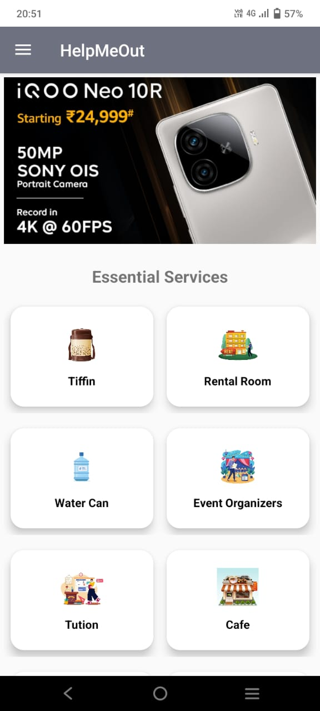
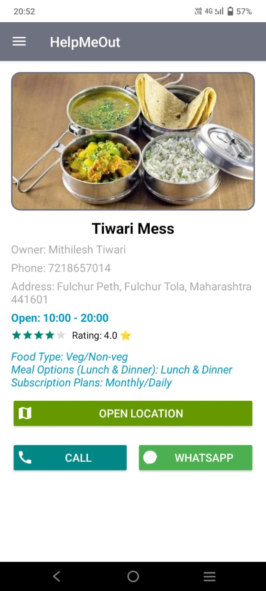

# HelpMeOut — A mobile app bridging the gap between local service providers and students.

## Features

- User and admin authentication and authorization
- Search for essential service providers in nearby areas
- Contact service providers directly through phone, whatsapp or Google map location
- Get detailed insight of services offered

## Technologies

- XML
- Java
- Firebase Realtime Database

## Usage

1. Install the app (user or admin)
2. Create a new account by signing up
3. You are ready to go!

## Screenshots

<table>
<tr>
<td></td>
<td></td>
</tr>
</table>

## Author
Sadique Khan
